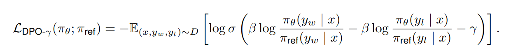
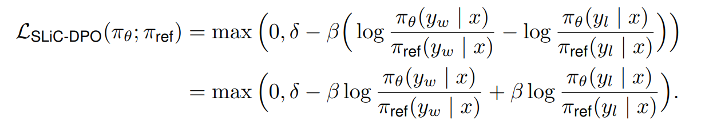

# DPO-γ & SLiC-DPO - New Preference Optimization Methods

This repository contains the code and released models for **DPO-γ** and **SLiC-DPO**, two innovative methods for preference optimization. These approaches offer substantial improvements over state-of-the-art methods like Direct Preference Optimization (DPO) when applied to Small Language Models (SLMs)[^1], particularly in tasks such as machine translation and summarization.

Notably, results demonstrate that our proposed approach, **DPO-γ, outperforms all other preference optimization methods considered in the machine translation and summarization tasks**. 

:robot: All trained models are available for download [here](https://huggingface.co/martimfasantos).

:scroll: For a detailed exploration of the algorithms and results, refer to my [thesis repository](https://github.com/martimfasantos/MSc-Thesis). 

[^1]: The definition of “small” is subjective and relative. We consider the upper limit of 5B parameters as for the size of SLMs, as done in state-of-the-art papers.

---


## DPO-γ

This algorithm combines the policy objective from DPO and SimPO’s target reward margin term, γ > 0, introduced to the Bradley-Terry objective to ensure that the reward for the winning response, _r(x, y<sub>w</sub>)_, exceeds the reward for the losing response, _r(x, y<sub>l</sub>)_, by at least γ. The resulting objective function for DPO-γ is defined as follows:



where π<sub>ref</sub> = π<sub>SFT</sub>. Similarly to DPO, an implicit reward can be fitted in such a way that the optimal policy simply becomes π<sub>θ</sub>.

---

## SLiC-DPO

Also aligning with DPO’s objective, we implement another custom approach, **SLiC-DPO**, which integrates DPO’s reward reparameterization with SLiC’s rank calibration loss. This combination results in the following loss function:



---


### Hyperparameter tuning
Hyperparameter tuning is crucial for these algorithms (and other preference optimization algorithms in general). The three main hyperparameters of DPO-γ and SLiC-DPO to focus on are `learning_rate`, `beta`, and `gamma` (we recommend keeping the total batch size fixed at 128).
- `learning_rate`: It is the most critical hyperparameter for preference optimization. A large learning rate (e.g., 1e-5) can significantly degrade performance, causing the model to produce incoherent sentences or completely repetitive responses. We recommend grid searching over 5e-8, 1e-7, 2e-7, and 3e-7, if resources allow. We find that a smaller learning rate (e.g., 1e-7) is more suitable for reasoning intensive domains like math for both DPO, DPO-γ and SLiC-DPO.
  
- `beta`: Beta controls the reward scaling between winning and losing responses. DPO-γ requires a similiar `beta` than DPO. In our work, we used a beta of `0.1` but we recognize that a further analysis and fine-tuning of this value could yield better results.
  
- `gamma`: Gamma controls the target reward margin. We recommend using `0.5` as a starting point for `gamma` and grid searching between `0` and `1`. A well-tuned `gamma` can provide a modest improvement for our algorithms, but it is not as critical as other hyperparameters.

**Training Hyperparameters for Released Models**
| Setting           | β   | γ   | Learning rate |
|-------------------|-----|-----|----------------|
| [EuroLLM-1.7B-Instruct](https://huggingface.co/utter-project/EuroLLM-1.7B-Instruct)      | 0.1 | 0.5 | 1e-7           |
| [Gemma-2-2B-IT](https://huggingface.co/google/gemma-2-2b-it)     | 0.1 | 0.5 | 1e-7           |
| [TinyLlama-1.1B](https://huggingface.co/TinyLlama/TinyLlama-1.1B-intermediate-step-1431k-3T)     | 0.1 | 0.5 | 1e-7           |

These parameters were obtained comparing the stability and performance of the algorithms across all models. This ensured a reliable comparison of RL-free preference optimization methods on small LMs and enabled a thorough evaluation of the models’ ability to align with human preferences. 

We conducted multiple initial experiments that allowed us to evaluate the effects of different hyperparameters on training stability, performance, and alignment with human preferences. 

**Full Hyperparameter Ranges**

| Parameter                     | Values                            |
|-------------------------------|------------------------------------|
| Learning Rate             | {5 × 10⁻⁸, 1 × 10⁻⁷, 2 × 10⁻⁷, 3 × 10⁻⁷} |
| Batch Size                | {16, 32, 64, 128}                |
| Beta (β)                  | {0.01, 0.05, 0.1}                |
| Number of Epochs          | {1, 2, 3}                        |
| Warmup Ratio              | {0.1, 0.15}                      |
| Gradient Accumulation Steps | {4, 8, 16, 32}                 |
| Number of Devices         | {1, 2, 4}                        |


---

## Install Requirements

The codebase is built upon the [alignment-handbook repo](https://github.com/huggingface/alignment-handbook). The following steps will guide you through the installation process.

First, create a Python virtual environment using e.g. pyenv:
```shell
python3 -m venv venv
```

Next, install PyTorch `v2.2.2`. Since this is hardware-dependent, we
direct you to the [PyTorch Installation Page](https://pytorch.org/get-started/previous-versions/).

```shell
# CUDA 12.1
pip install torch==2.2.2 torchvision==0.17.2 torchaudio==2.2.2 --index-url https://download.pytorch.org/whl/cu121
```

You can then install the remaining package dependencies of [alignment-handbook](https://github.com/huggingface/alignment-handbook) as follows:

```shell
git clone https://github.com/huggingface/alignment-handbook.git
cd ./alignment-handbook/
python -m pip install .
```

You will also need Flash Attention 2 installed, which can be done by running:

```shell
python -m pip install flash-attn --no-build-isolation
```

## Training Scripts

We provide some examples of training config files for the training setups reported in our work. The training config is optimized for 4 NVIDIA RTX A6000 48GB GPUs. You may need to adjust `num_processes` and `per_device_train_batch_size` based on your computation environment. 

#### Machine Translation
* EuroLLM 1.7B:
```shell
ACCELERATE_LOG_LEVEL=info accelerate launch --config_file accelerate_configs/deepspeed_zero3.yaml algorithms/run_custom_po.py training_configs/eurollm-1.7b/mt/eurollm-1.7b-it-dpo-gamma-mt.yaml
```
* Gemma-2 2B:
```shell
ACCELERATE_LOG_LEVEL=info accelerate launch --config_file accelerate_configs/deepspeed_zero3.yaml algorithms/run_custom_po.py training_configs/gemma-2-2b/mt/gemma-2-2b-it-dpo-gamma-mt.yaml
```
* TinyLlama 1.1B:
```shell
ACCELERATE_LOG_LEVEL=info accelerate launch --config_file accelerate_configs/deepspeed_zero3.yaml algorithms/run_custom_po.py training_configs/tinyllama-1.1b/mt/tinyllama-1.1b-dpo-gamma-mt.yaml
```

#### Summarization
* Gemma-2 2B:
```shell
ACCELERATE_LOG_LEVEL=info accelerate launch --config_file accelerate_configs/deepspeed_zero3.yaml algorithms/run_custom_po.py training_configs/gemma-2-2b/sum/gemma-2-2b-it-dpo-gamma-sum.yaml
```
* TinyLlama 1.1B:
```shell
ACCELERATE_LOG_LEVEL=info accelerate launch --config_file accelerate_configs/deepspeed_zero3.yaml algorithms/run_custom_po.py training_configs/tinyllama-1.1b/sum/tinyllama-1.1b-dpo-gamma-sum.yaml
```

## Evaluation

We compare our models against state-of-the-art models using commonly used automatic metrics:

| Task                  | Metrics                                                    |
|-----------------------|------------------------------------------------------------|
| **Machine Translation** | chrF ([Popović, 2015](#)) ↑                              |
|                       | BLEU ([Papineni et al., 2002](#)) ↑                        |
|                       | COMET-22 ([Rei et al., 2020](#)) ↑                         |
|                       | XCOMET ([Guerreiro et al., 2023](#)) ↑                     |
| **Summarization**      | ROUGE ([Lin, 2004](#)) ↑                                  |
|                       | METEOR ([Banerjee and Lavie, 2005](#)) ↑                   |
|                       | BERTScore ([Zhang et al., 2020](#)) ↑                      |
|                       | Reward ([Song et al., 2023](#)) ↑                          |

We also study the effectiveness of preference learning algorithms by **assessing their alignment with human preferences**, specially when considering small LLMs.

:dart: Our results show that **DPO-γ outperforms all preference optimization methods considered in the machine translation and summarization tasks** and **is capable of further aligning the models with human preferences.**

For further results and details on the evaluation and alignment with human preferences, please refer to [this repo](https://github.com/martimfasantos/MSc-Thesis).


## Bugs or Questions?
If you encounter any problems when using the code, or want to report a bug, feel free to open an issue! Please try to specify the problem with details so we can help you better and quicker!

